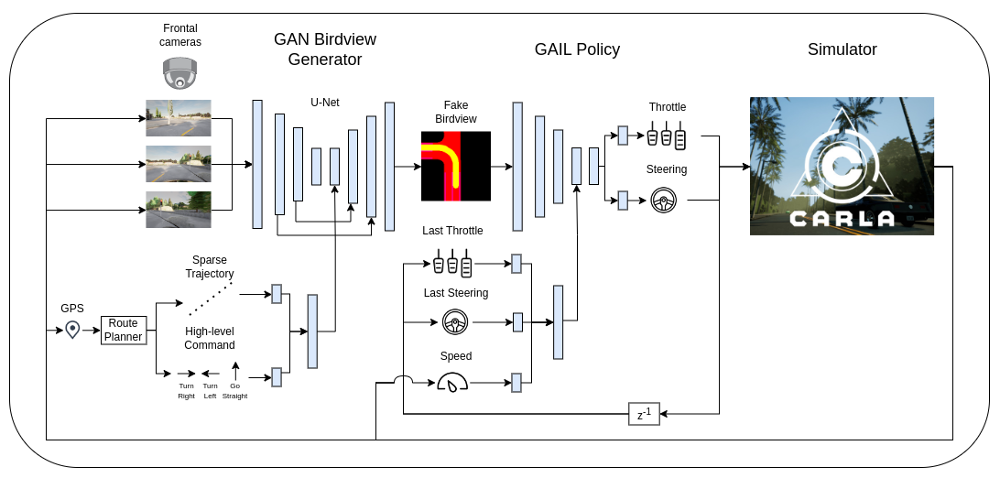

# Hierarchical GAIL

<p align="center">
  
</p>

Official implemention of the paper [Hierarchical Generative Adversarial Imitation Learning with Mid-level Input Generation for Autonomous Driving on Urban Environments](https://arxiv.org/abs/).

## Installation
1. Install python3.8.
2. Install required packages from `requirements.txt` file.

## Reproducing results
* To collect data from expert run the `start_expert.sh` script.

* To train the agents from the paper set the following variables global variables from the file `rl_train.py`.

* The variable `FAKE_BIRDVIEW` controls if the agent will use the birdview from the env or generated by the GAN.

* The variable `GAIL` controls if the agent will be trained using GAIL or PPO.

* The variable `RGB_GAIL` controls if the agent trains from birdview images or directly from images generated by the cameras.

* The variable `RESUME_LAST_TRAIN` controls if the agent will start a new training or resume the last one.

* To train an agent using GAIL or PPO run the `start_rl.sh` script after setting the appropriate variables.

* To train an agent using Behavior Cloning run the `start_bc.sh` script.

* To train only the GAN birdview using the samples from the expert demonstrations run the `start_gan.sh` script.

## Results

* The results are logged using Wandb (Weights & Biases) that is similar to an online user based tensorboard.

* The training is logged in runs, where one csv table with data from every step is generated for each environment.

* The agent parameters are saved in a pytorch file every epoch in the `ckpt` directory identified by the epoch number of steps.

* To evaluate an agent run the `eval_agent.sh` script after setting the appropriate variables from in file `evaluate_agent.py`.

## Generating plots

* In the `paper_plots` directory there are many scripts to generate the plots used in the paper

## Generating videos

* To generate videos from the agent evaluation use the `generate_video.py` python script.

## Disclaimer

This project is built upon the code from the following projects:

* Official **[code release](https://github.com/zhejz/carla-roach)** of the paper<br> 
**[End-to-End Urban Driving by Imitating a Reinforcement Learning Coach](https://arxiv.org/abs/2108.08265)** <br> 

* Official **[code release](https://github.com/zhejz/carla-roach)** of the paper<br> 
**[Augmenting GAIL with BC for sample efficient imitation learning](https://arxiv.org/abs/2001.07798)** <br> 

* **[PyTorch-GAN](https://github.com/eriklindernoren/PyTorch-GAN)**

## Citation

Please consider citing our paper if you find it useful or want to use it in your research:

```
@misc{hGAIL,
      title={Hierarchical Generative Adversarial Imitation Learning with Mid-level Input Generation for Autonomous Driving on Urban Environments}, 
      author={Gustavo Claudio Karl Couto and Eric Aislan Antonelo},
      year={2023},
}
```
